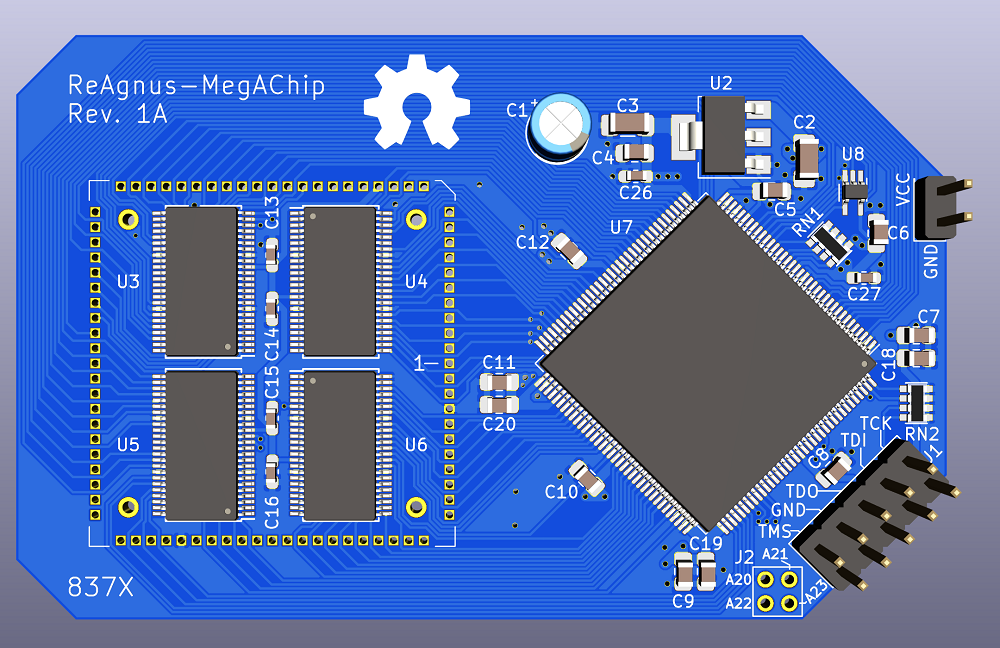
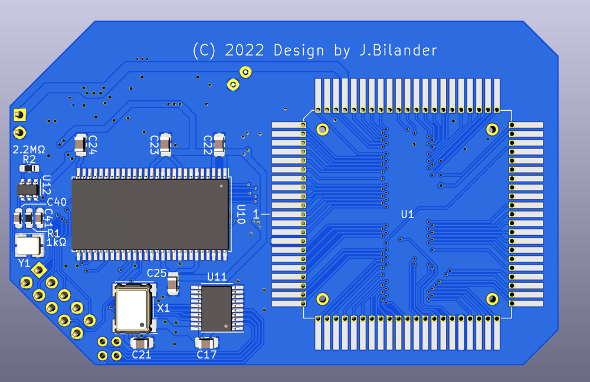

# ReAgnus-MegAChip
A ReAgnus MegaAChip PCB that takes a Gowin FPGA, a PLCC-84 plug, level shifters and a SDRAM-chip.

***

***

***

BOM Rev. 1A
---------
Designator  | Name/Value   | Package | Notes
-|-|-|-|
U1 | Winslow PLCC-84 Plug | PLCC-84 Plug | 
U2 | Voltage Regulator 3.3V,   LM1117-3.3 or   AMS1117-3.3 | SOT-223 | 3.3V 1A Low Drop-Out (LDO) Voltage regulator. https://www.aliexpress.com/item/32869037691.html
U3,U4,U5,U6 | Digital Bus Switch ICs 20-Bit FET, SN74CBTD16210 | TSSOP-48 | FET Level-shifter   * [SN74CBTD16210](https://www.ti.com/lit/ds/symlink/sn74cbtd16210.pdf)
U7 | Gowin FPGA GW1N-UV9LQ144C6/I5 | LQFP-144 | FPGA - Field Programmable Gate Array, 8640 LE, 120 I/O   * [GW1N-UV9LQ144C6/I5](https://www.mouser.com/ProductDetail/192-GW1NUV9LQ144C6I5)
U8 | 74LVC1G07 Single Buffer With Open-Drain Output | SOT-353, SC-70-5 | * [74LVC1G07](https://www.ti.com/lit/ds/symlink/sn74lvc1g07.pdf)
U9 | PLCC-84_TH_pin_holes | Agnus_TH_plug_pins | Optionally used with home made plug
U10 | DRAM 64Mb, SDR SDRAM, x16 | TSOP-II-54 22.2x10.16mm P0.8mm | * [W9864G6KH-6I](https://www.mouser.com/datasheet/2/949/w9864g6kh_a03_20170326-1489678.pdf)
U11 | Bus Transceiver 74LVC245APW,118 | TSSOP-20 | * [74LVC245APW-T](https://www.mouser.com/ProductDetail/771-74LVC245APW-T)
U12 | X-tal driver 74LVC1GX04  | TSOP-6 1.65x3.05mm P0.95mm | * [74LVC1GX04](https://www.mouser.com/datasheet/2/916/74LVC1GX04-2937637.pdf)
X1 | Clock Oscillator 100.0MHz | 7.0 x 5.0mm | * [831022731](https://www.mouser.com/ProductDetail/710-831022731)
Y1 | 18pF Crystal 28.6363 MHz (NTSC) or 28.375 MHz (PAL) | 3.2 mm x 2.5 mm | * [ECS-286.3-18-33-JEM-TR](https://www.mouser.com/ProductDetail/520-286.3-18-33-JEMT) (NTSC)  * [ABM8-28.375MHZ-B2-T](https://www.mouser.com/ProductDetail/815-ABM8-28.375-B2-T) (PAL)
