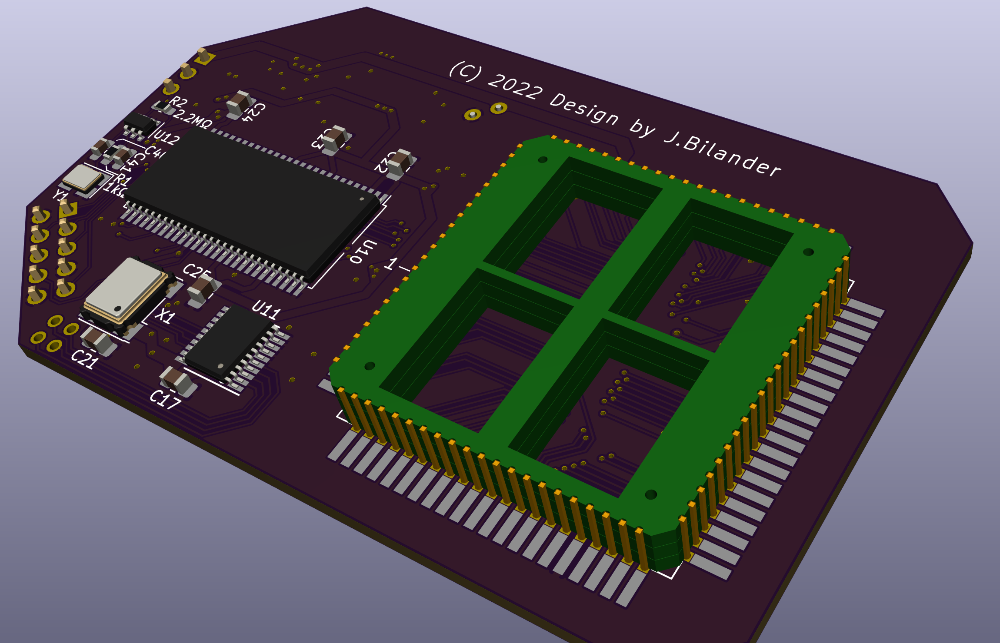
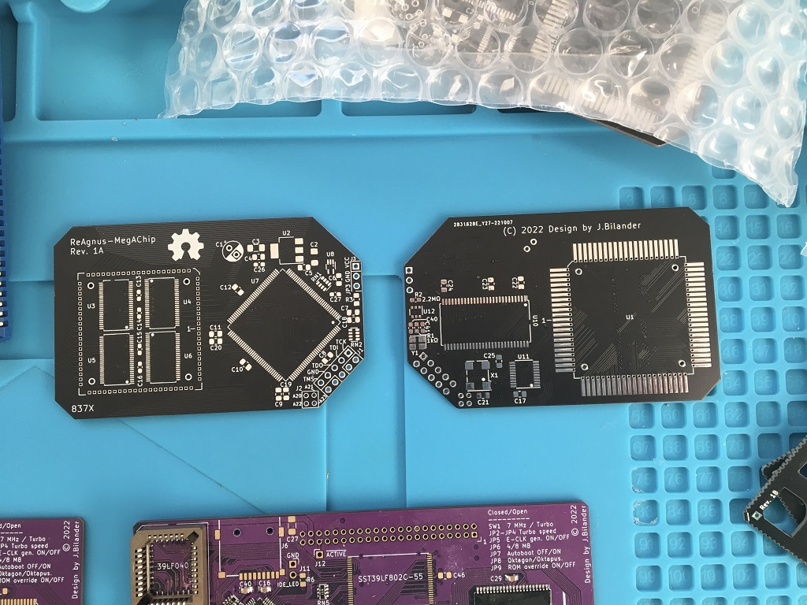

# ReAgnus-MegAChip
A ReAgnus MegaAChip PCB that takes a Gowin FPGA with embedded PSRAM, a PLCC-84 plug and FET level shifters.

***

THIS IS WORK IN PROGRESS AND NOT VERIFIED WORKING. BUILD AT YOUR OWN RISK.

***

***

***

***
For hi-res pics goto the hi-res folder in pics
https://github.com/jbilander/ReAgnus-MegAChip/tree/main/pics/hi-res

***

BOM Rev. 2A
---------
Designator  | Name/Value   | Package | Notes
-|-|-|-|
U1 | Gowin FPGA GW1NR-UV9LQ144PC6/I5 | LQFP-144 | FPGA - Field Programmable Gate Array, 8640 LE, 121 I/O, Embedded 64Mbit 16-bit PSRAM   [GW1NR-UV9LQ144PC6/I5](https://www.mouser.com/ProductDetail/192-1NRUV9LQ144PC6I5)
U2 | Voltage Regulator 3.3V,   LM1117-3.3 or   AMS1117-3.3 | SOT-223 | 3.3V 1A Low Drop-Out (LDO) Voltage regulator. https://www.aliexpress.com/item/32869037691.html
U3 | Voltage Regulator 4.3V, TPS73643DBVR or   ABLIC S-1200B43-M5T1U | SOT-23-5 | 4.3V LDO Voltage Regulator [TPS73643DBVR](https://www.mouser.com/ProductDetail/595-TPS73643DBVR)  [S-1200B43-M5T1U](https://www.mouser.com/ProductDetail/628-S-1200B43-M5T1G)
U4,U5,U6,U7 | Digital Bus Switch ICs 20-Bit FET, SN74CBT16210CDGVR | TVSOP-48 | FET Level-shifter   [SN74CBT16210CDGVR](https://www.mouser.com/ProductDetail/595-SN74CBT16210CDGV)
U8 | 74LVC1G07 Single Buffer With Open-Drain Output | SOT-353, SC-70-5 | [74LVC1G07](https://www.mouser.com/ProductDetail/621-74LVC1G07SE-7)
U9 | X-tal driver 74LVC1GX04  | TSOP-6 1.65x3.05mm P0.95mm | [74LVC1GX04](https://www.mouser.com/ProductDetail/771-LVC1GX04GV125)
U10 | Bus Transceiver 74LVC245APW,118 | TSSOP-20 | [74LVC245APW-T](https://www.mouser.com/ProductDetail/771-74LVC245APW-T)
U11 | Winslow PLCC-84 Plug | PLCC-84 Plug | Optionally home made plug
U12 | PLCC-84_TH_pin_holes | Agnus_TH_plug_pins | Optionally used with home made plug
Y1 | 18pF Crystal 28.6363 MHz (NTSC) or 28.375 MHz (PAL) | 3.2 mm x 2.5 mm | [ECS-286.3-18-33-JEM-TR](https://www.mouser.com/ProductDetail/520-286.3-18-33-JEMT) (NTSC)  [ABM8-28.375MHZ-B2-T](https://www.mouser.com/ProductDetail/815-ABM8-28.375-B2-T) (PAL)
R1 | Resistor 1k Ω | 0603 SMD | Resistor in optional Oscillator-circuit
R2 | Resistor 2.2M Ω | 0603 SMD | Resistor in optional Oscillator-circuit
R3 | Resistor 33 Ω | 0805 SMD | Series resistor for CLK from U9 to avoid reflections (in optional Oscillator-circuit).
RN1 | 4.7k or 10k Ω RES ARRAY 4 Resistors | 1206 | [CAY16-4701F4LF](https://www.mouser.com/ProductDetail/652-CAY16A-4701F4LF) or [CAY16-103J4LF](https://www.mouser.com/ProductDetail/652-CAY16-103J4LF)
RN2 | 4.7k (CAY16-4701F4LF) RES ARRAY 4 Resistors | 1206 | [CAY16-4701F4LF](https://www.mouser.com/ProductDetail/652-CAY16A-4701F4LF)
C1 | Capacitor Radial Polarized 100uF | 2.5mm pitch, Through-Hole |
C2-C4 | Capacitor 10uF | 1206 | 
C5 | Capacitor 1uF | 0805 | 
C6-C16 | Capacitor 0.1uF = 100nF | 0805 |
C17-C20 | Capacitor 0.01uF = 10nF | 0805 or 0603 |
C21-C24 | Capacitor 0.1uF = 100nF | 0603 | Decoupling caps for U4-U7
C25 | Capacitor 0.1uF = 100nF | 0603 | Optional cap for U3, NR (Noise Reduction) pin 4 on TPS73643DBVR, this pin is NC on ABLIC S-1200B43-M5T1U
C26-C27 | Capacitor 0.01uF = 10nF | 0603 |
C28-C29 | Multilayer Ceramic Capacitors MLCC - 32pF | 0603 | [06031A320FAT2A ](https://www.mouser.com/ProductDetail/581-06031A320FAT2A) Caps for optional oscillator circuit 
J1 | VCC/GND Power Header Male | TH 1 x 2 Pin, 2.54mm pitch | For external power supply to allow programming of device when not plugged into the Amiga socket.
J2 | JTAG1 Pin Header Male | TH 2 x 5 Pin, 2.54mm pitch|
J3 | A20-A23 Pin Header Male | TH 2 x 2 Pin, 2.00mm pitch | Input Address lines for jumper-wires A20-A23
J4 | GND MountingHole_2.2mm_M2_Pad_Via | nut and bolt M2 size | for solid grounding via a ring lug connector and a thick jumper wire to Motherboard

***

Select one of the crystals 28.375 MHz (PAL) or 28.6363 MHz for the optional onboard oscillator circuit. Probably you want to select PAL/NTSC opposite to what your CLK on motherboard has, this in order to be able to switch between native PAL/NTSC with only a JP-setting on the MegaChip board.
***

***

***

***

***

***

***

***

***

***

***
